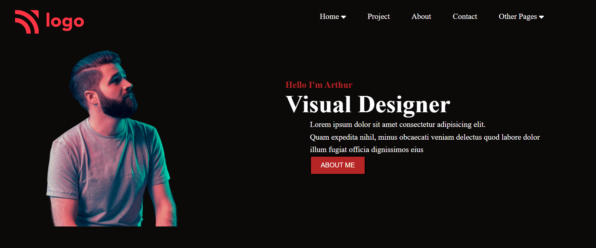
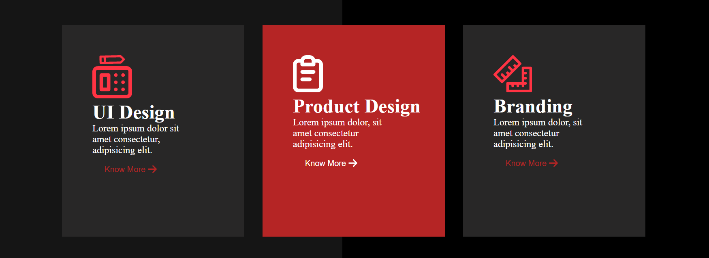
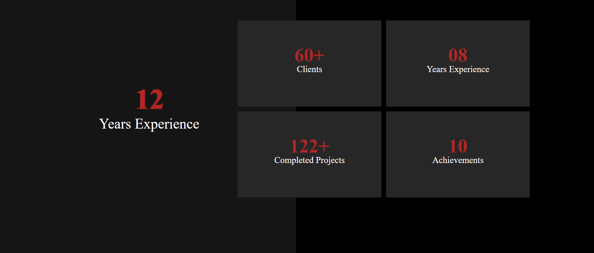
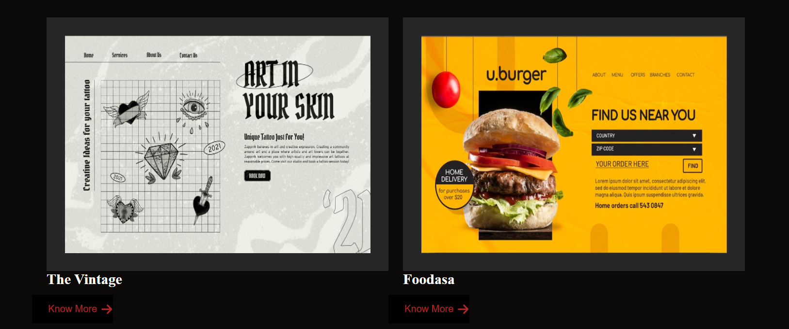
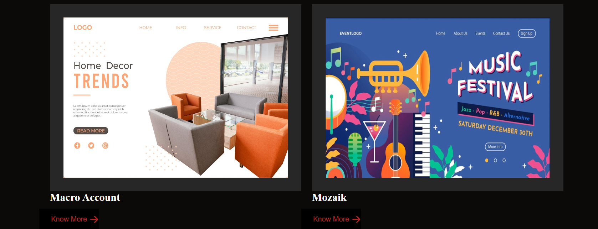
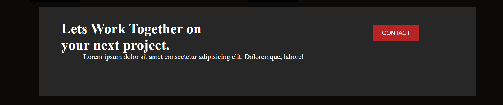
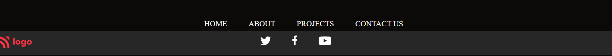

# PROJECT15(HTML&CSS)

##  Learnings from this Project:

- Learnt how to apply Color variation for Background.

- Gained indepth knowledge on Positions Property.

- Got a clear idea on Using Font Awesome icons.

### Time Taken: 
5.5 hours

[Live-Link](https://project15-htmlcss.netlify.app/)

